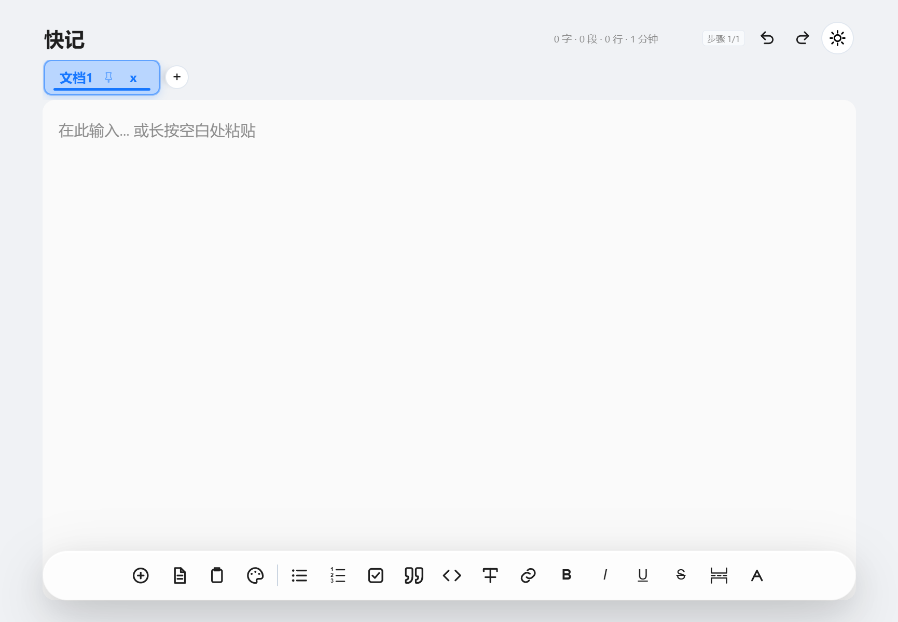

# 快速记录 Pro

一个**完全离线**的单文件笔记应用：双击 HTML 就能用，也可打包成 Windows 桌面版和 Android APK。
所有数据只存在你自己的设备上，不联网、不上传、无账号。



---

## 下载

| 平台 | 说明 | 下载 |
|---|---|---|
| **HTML 版** | 单个 `.html` 文件，双击即用，也可丢进任何现代浏览器 | [快速记录pro.html](快速记录pro.html) |
| **Windows 版** | 绿色免安装目录（zip 约 149 MB），解压后运行 `快速记录pro.exe` | [Releases 页面](/releases/latest) |
| **Android 版** | 单文件 HTML 套 WebView 壳，约 140 KB | [Releases 页面](/releases/latest) |

> Windows 与 Android 安装包体积较大，放在 [Releases](/releases/latest)；仓库里只有源码和构建脚本。

---

## 功能

**编辑**
- 富文本编辑：加粗 / 斜体 / 下划线 / 删除线 / 标题 / 引用 / 代码块
- 有序列表、无序列表、待办清单（列表缩进与圆点对齐经过像素级调校）
- 表格插入与编辑、分割线、图片粘贴（存 IndexedDB，不占 localStorage）

**组织**
- 多文档标签页：置顶、拖拽换序、滚轮/手指横滑、中键关闭、关闭后跳相邻标签
- 四套主题：浅色 / 深色 / 毛玻璃（frost）/ 护眼绿
- 模板系统 + 常用语快捷插入
- 撤销 / 重做、历史记录、回收站

**占位符**（模板与常用语均可用）

| 占位符 | 输出 |
|---|---|
| `{{date}}` | `2026-09-14`，可自定义 `{{date:YYYY年MM月DD日}}` |
| `{{time}}` | `23:56`，可 `{{time:HH:mm:ss}}` |
| `{{datetime}}` | `2026-09-14 23:56` |
| `{{weekday}}` | `星期一`，简写 `{{weekday:周}}` → `周一` |
| `{{title}}` | 当前文档标题 |
| `{{ts}}` | 毫秒时间戳，`{{ts:s}}` 秒级 |

格式符号：`YYYY` 年 · `MM` 月 · `DD` 日 · `HH` 时 · `mm` 分 · `ss` 秒

**数据**
- 全量备份 / 恢复（JSON，含 IndexedDB 图片）
- 导出为 Markdown、HTML、纯文本

---

## 各平台使用说明

### HTML 版

下载 [快速记录pro.html](快速记录pro.html)，双击即可。

> 出于浏览器安全策略，`file://` 打开时「一键粘贴」会询问剪贴板权限（每次一次）。
> 想彻底免弹窗，请用 Windows 版，或在浏览器里把该页面加入信任站点。

### Windows 版

1. 从 [Releases](/releases/latest) 下载 `快速记录pro-win-x64.zip` 并解压（**整个文件夹一起解压，别只拷 exe**）
2. 运行 `快速记录pro.exe`
3. 首次启动若出现 SmartScreen 蓝色提示 → 点「更多信息 → 仍要运行」（exe 未签名，自用无碍）

能力：

| 能力 | 说明 |
|---|---|
| 全局热键 | `Ctrl + Alt + N` 任意界面呼出 / 隐藏 |
| 托盘常驻 | 点 `×` 收进托盘不退出；左键托盘图标切换显示，右键可退出 |
| 开机自启 | 默认开启，托盘菜单可关。**移动文件夹后会自动修正注册表路径** |
| 剪贴板 | 走 `app://` 安全协议，一键粘贴**零弹窗** |

数据目录：`%APPDATA%\快速记录pro`

**更新页面无需重新打包** —— 直接覆盖 `resources\assets\index.html` 即可。

### Android 版

从 [Releases](/releases/latest) 下载 APK 安装（应用名：备忘录）。
WebView 壳提供原生能力：静默读取剪贴板、收起输入法、系统状态栏高度适配。

---

## 数据迁移

三个版本数据各自独立，用**备份 / 恢复**搬家：

1. 原版本 →「更多」→「备份全部数据」→ 得到 JSON
2. 新版本 →「更多」→「恢复备份」→ 选择该 JSON

浏览器换壳（比如从 HTML 版换到 Windows 版）必须搬这一次，之后各用各的。

---

## 从源码构建

### Android

```bash
cd android
cp sign.properties.example sign.properties   # 填写 KS_PASS
bash build.sh
```

需要 Android SDK（build-tools + platform）与 JDK 17+。脚本会自动探测 SDK 版本，
产物为 `app-release-<时间戳>.apk`。

> 若你本地已有旧版 `keystore.jks`，把它放到 `android/` 目录并在 `sign.properties` 里填对应密码，
> 可沿用原签名，保证覆盖安装。

### Windows

```bash
cd windows
npm install
npm start          # 开发模式
bash assemble.sh   # 产出免安装绿色目录 dist/快速记录pro/
```

国内网络下载 Electron 较慢时：

```bash
export ELECTRON_MIRROR=https://npmmirror.com/mirrors/electron/
```

---

## 目录结构

```
quick-notes/
├── 快速记录pro.html      # ★ 唯一真源，所有平台共用同一份页面
├── android/              # Android WebView 壳 + 构建脚本
│   ├── src/              # MainActivity（原生桥）
│   ├── res/ assets/      # 资源与页面副本
│   └── build.sh
├── windows/              # Electron 壳
│   ├── main.js           # app:// 协议、托盘、热键、自启
│   ├── assemble.sh       # 手工组装绿色目录
│   └── assets/
└── docs/                 # 截图
```

**改功能只改根目录的 `快速记录pro.html`**，改完同步到 `android/assets/` 与 `windows/assets/` 再构建。

---

## 隐私

- 全部数据存放于本地（浏览器 localStorage / IndexedDB，或应用数据目录）
- 无任何网络请求、无统计、无账号体系
- 仓库不含任何用户数据

---

## 已知限制

- Windows 版 exe 未签名，首次运行有 SmartScreen 提示（自用点「仍要运行」即可）
- Android 版依赖系统 WebView，过旧的系统可能不支持毛玻璃主题
- HTML 版在 `file://` 下的剪贴板权限无法持久化（浏览器安全策略，非应用缺陷）

---

## 许可

[MIT](LICENSE) © 2026 lyw-6
